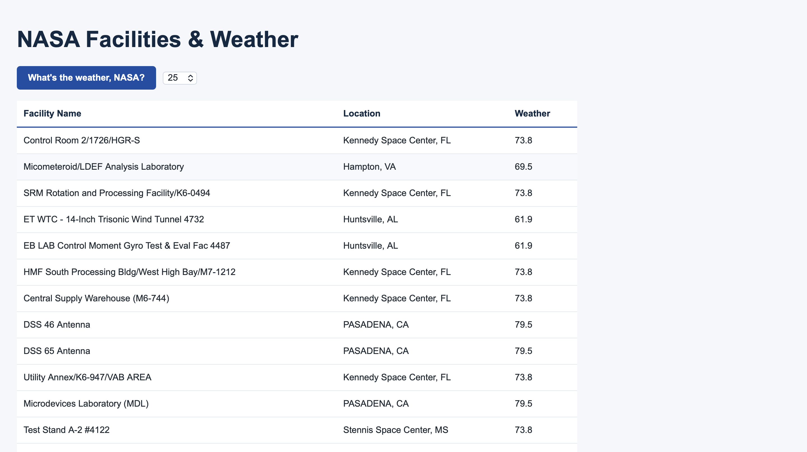

# 🚀 Project: Complex NASA API

### Goal: Use NASA's API to return all of their facility locations (~400). Display the name of the facility, its location, and the weather at the facility currently. 

### How to submit your code for review:

- Fork and clone this repo
- Create a new branch called answer
- Checkout answer branch
- Push to your fork
- Issue a pull request
- Your pull request description should contain the following:
  - (1 to 5 no 3) I completed the challenge
  - (1 to 5 no 3) I feel good about my code
  - Anything specific on which you want feedback!

Example:
```
I completed the challenge: 5
I feel good about my code: 4
I'm not sure if my constructors are setup cleanly...
```

---

## My Solution

A web application that retrieves NASA facility data and displays the current weather for each facility.

Users can choose how many NASA facilities to display — 25, 50, 100, or all available facilities — and view each facility's name, location, and current temperature.



## How It's Made

**Tech used:** HTML, CSS, JavaScript, NASA API, WeatherAPI

The application retrieves NASA facility data and loops through the returned facilities. For each facility, it uses the location data to make a second API request to WeatherAPI and displays the current temperature alongside the facility information.

## What I Learned

This project gave me additional practice working with multiple APIs, parsing returned data, using loops to process API results, making API requests with dynamic values, and rendering the returned information to the DOM.